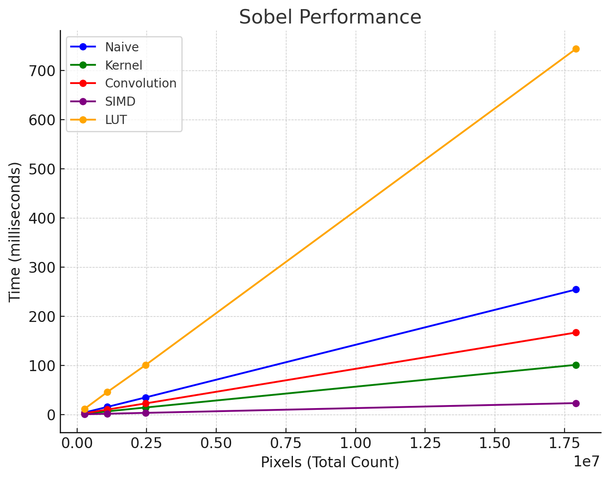

### 
 LEHRSTUHL FÜR RECHNERARCHITEKTUR UND PARALLELE SYSTEME 
# 
 Grundlagenpraktikum: Rechnerarchitektur - Sobel-Filter (A201)

---

### 
 Wintersemester 24/25 - Abschlussprojekt t001

 Tobias Langer - Luca Tänzler - Salim Daoud 

---
## 1 Aufgabenstellung
Im Rahmen des Praktikums soll ein Sobel-Filter für die Bildverarbeitung implementiert werden.
Ziel der Aufgabe ist es, ein farbiges Bild zunächst in ein Graustufenbild umzuwandeln und anschließen mithilfe des Sobel-Filters Kanten hervorzuheben.
Die Implementierung soll dabei in C erfolgen und die Performanz der verschiedenen Implementierungen mithilfe von Benchmarks verglichen werden.
Außerdem muss ein Rahmenprogramm geschrieben werden, welches Optionen für das Programm entgegennimmt und sich auch um Fehlerbehandlung kümmert.

## 2 Überblick über die Implementierungen
### 2.1 Graustufen-Konvertierung
#### 2.1.1 Referenzimplementierung (naiv) 
Ein Pixel (dargestellt durch einen Vektor aus den drei Farbkanälen Rot (R), Grün (G) und Blau (B))
wird in Graustufen umgewandelt, indem der gewichtete Durchschnitt D mittels der Koeffizienten a, b und c berechnet wird:
$$
D = \frac{a \cdot R + b \cdot G + c \cdot B}{a + b + c}
$$

#### 2.1.2 SIMD-Implementierung
Die Methode nutzt SIMD-Befehle (Single Instruction Multiple Data) um 4 Pixel gleichzeitig zu verarbeiten und dadurch die Rechenzeit zu optimieren.
Die zu grunde liegende Formel ist dieselbe wie bei der Referenzimplementierung.
Pixel, die nicht durch 4 teilbar sind, werden einzeln in einer zusätzlichen Schleife verarbeitet.

#### 2.1.3 Implementierung mit Bit-shift
Wir haben versucht mithilfe von Bit-shifts die Effizienz der Berechnungen zu verbessern.
Dabei haben wir festgestellt, dass die Multiplikation der Pixelwerte mit den idealen Koeffizienten durch eine Approximation mittels Bit-shifts dargestellt werden kann.

### 2.2 Sobel-Filter
#### 2.2.1 Referenzimplementierung (naiv)
Der Sobel-Filter wird in mehreren Stufen angewandt.
Zunächst wird das Graustufenbild Q getrennt nach vertikalen (v) und nach horizontalen (h) Kanten gefiltert: 
$$
Q^v = M^v \ast Q \quad Q^h = M^h \ast Q
$$
mit den Faltungsmatrizen $M^v$, $M^h$ der Dimension 3:
$$ 
M^v = \begin{pmatrix} 1 & 0 & -1 \\ 2 & 0 & -2 \\ 1 & 0 & -1 \end{pmatrix} \quad M^h = \begin{pmatrix} 1 & 2 & 1 \\ 0 & 0 & 0 \\ -1 & -2 & -1 \end{pmatrix} 
$$
Somit lässt sich die Berechnung des neuen Graustufenpixels mittels der Faltung folgendermaßen darstellen (i und j bezeichnen wie gewohnt die (Null-basierte) Reihe und Spalte einer Matrix):
$$
Q^d_{(x, y)} = \sum_{i=-1}^{1} \sum_{j=-1}^{1} M^d_{(1+i, 1+j)} \cdot Q_{(x+i, y+j)} \quad d \in \{v, h\}
$$
Sind $Q^v$ und  $Q^h$ berechnet worden, kombiniert man beide Bilder pixelweise zum Gesamtbild $Q'$:
$$ 
Q'_{(x, y)} = \text{clamp}_{0}^{255} \left(\sqrt{\left(Q^v_{(x, y)} \right)^2 + \left(Q^h_{(x, y)} \right)^2} \right) 
$$

#### 2.2.2 Implementierung mit LUT
Diese Implementierung orientiert sich wieder an der naiven Implementierung des Sobel-Filters.
Ausnahme dabei ist, dass hierbei eine Lookup-Tabelle genutzt wird, um die Quadratwurzel zu berechnen, anstatt die Wurzelfunktion aus der C-Bibliothek zu nutzen.
Alle Quadratwurzeln mit den Werten 0 bis 254 wurden vorab berechnet und in einer Lookup-Tabelle gespeichert.
An dieser Stelle kann ebenso erwähnt werden, dass eine weitere Form der Quadratwurzel implementiert wurde, diese approximate das Ergebnis und nutzt nur simple mathematische Operationen.

#### 2.2.3 Implementierung mit kernel unroll
Wir haben festgestellt, dass die vertikale Matrix eine Spalte mit Nullen und die horizontale Matrix eine Zeile mit Nullen enthält.
Daher können wir uns bei der Multiplikation jeder Matrix mit den Bildpixeln die Berechnung dieser Nullen sparen.
Außerdem konnten wir erkennen, dass die verbleibenden Werte beider Matrizen auf die Konstanten 1, -1, 2 und -2 beschränkt sind.
Daher haben wir die Iterationen über beide Matrizen optimiert, indem wir diese fixen Werte direkt genutzt haben.

#### 2.2.4 SIMD-Implementierung
Die Methode basiert auf dem vorigen Algorithmus mit kernel unroll und nutzt zusätzlich SIMD-Instruktionen zur Berechnung.
Mithilfe von SIMD werden 8 Pixel gleichzeitig verarbeitet und somit die größten Zeitersparnisse beim Anwenden des Sobel-Filters erzielt.
Falls die Anzahl der Pixel nicht durch 8 teilbar ist, wird die letzte Zeile separat ohne Verwendung von SIMD-Instruktionen verarbeitet.

#### 2.2.5 Implementierung mit separierten Filtern
Hierbei handelt es sich um eine Implementierung des Sobel-Filters mithilfe von separierten Filtern.
Dabei wird in die Anzahl der nötigen Operationen bei einem 2D-Bildfilter reduziert, indem der Filter in zwei 1D-Filter aufgeteilt wird.
So kann von MxN Operationen auf M+N Operationen reduziert werden.
Dies ist hier ein wenig langsamer bei unserem Beispiel, da wir nur 3x3 Filter verwenden, der Vorteil wird bei größeren Filtern deutlicher.

## 3 Performanzmessungen
### 3.1 Messumgebung
Getestet wurde auf einem System mit einem AMD Ryzen 5 4680U Prozessor, 2.20 GHZ, 8 GB Arbeitsspeicher, Ubuntu 24.10, 64 Bit, Linux-Kernel 6.11.
Kompiliert wurde mit GCC 13.3.0 mit der Option -O2.

### 3.2 Methodik
Die Berechnungen wurden mit Eingabegrößen von 640×426 bis 5184×3456 Pixeln jeweils 1000-mal durchgeführt und das arithmetische Mittel für jede Eingabegröße wurde in folgendes Diagramm eingetragen.

### 3.3 Ergebnisse

In unserem Testrahmen mit der Referenzimplementierung als Standard, konnten wir feststellen, dass die SIMD-Implementierung, wie erwartet, die schnellste ist, vor allem bei größeren Bildern.
Die spezielleren Versuche den Algorithmus zu verbessern, haben zu eher kleineren Verbesserung der Laufzeit geführt (zumindest bei derzeitiger Methodik).
Lookup-Tabellen hingegen haben unsere Laufzeit deutlich verschlechtert.

## 4 Anteile der einzelnen Projektmitglieder
### 4.1 Tobias Langer
- Refactoring und generelle Code Verbesserungen
- Implementierung von Sobel mit separierten Filtern
- Implementierung des Sobel-Filters mit SIMD mit 8 Pixeln
- Implementierung Grayscaling mit SIMD
- Erstellen von Grafiken für die Präsentation

### 4.2 Luca Tänzler
- Erste Zeitmessung für Sobel-Filter und Graustufen-Konvertierung
- Implementierung einer simplen Quadratwurzel-Funktion
- Verfassen des Projektberichts und der Präsentationsfolien
- Durchführung der Performanzmessungen

### 4.3 Salim Daoud
- Erste naive Sobel Implementierung mit Makefile und Argumenten-Verarbeitung
- Graustufen-Konvertierung mit SIMD und paralleles Lesen und Schreiben
- Erste Implementierung von Sobel SIMD und kernel unroll
- Tests zum Prüfen von Korrektheit